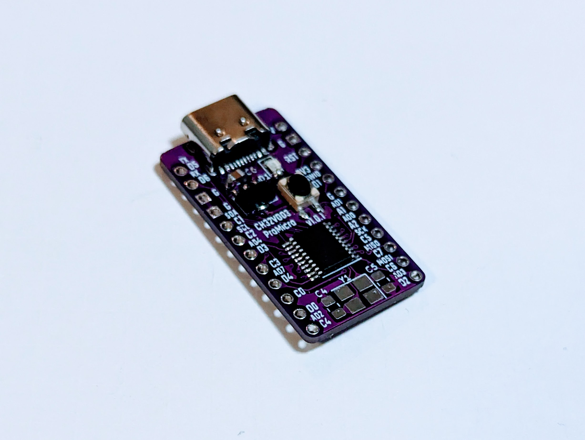
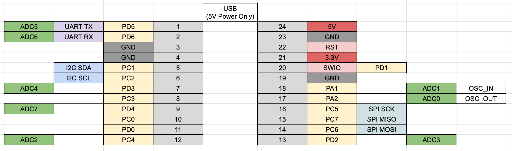

# WCH CH32V003 ProMicro サイズ開発ボード

## CH32V003ProMicro v1.0.1

### features

- 裏面には、バージョンは v1.0.0 と表記されていますが、v1.0.1 の誤りです。
- USB ソケットは 5V 電源専用であり、通信はできません。
- キットには、クリスタル及びクリスタル横のコンデンサは含まれていません。内蔵発信器を使用するため、不要です。外部発信器を使用する場合は、SMD 3225 24MHz クリスタルと、0805 22pF のコンデンサを、用意の上実装してください。
- ProMicro を再現するには、CH32V003 は GPIO の数が足りないため、19 Pin を R5 0R で GND 接続するようにしています。
- MCU の VCC は 3.3V になっていますが、JP1 を接続し、U2 3.3V レギュレータを外すことで、5V にすることができます。

### Data Sheet

- Semantics [PDF](ch32v003-promicro-semantics-v1.0.1.pdf) [kicanvas](https://kicanvas.org/?github=https%3A%2F%2Fgithub.com%2F74th%2Fch32v-dev-boards%2Fblob%2Fch32v003promicro%2F1.0.1%2Fch32v003-promicro%2Fch32v003-promicro.kicad_sch)
- PCB [PDF](ch32v003-promicro-pcb-v1.0.1.pdf) [kicanvas](https://kicanvas.org/?github=https%3A%2F%2Fgithub.com%2F74th%2Fch32v-dev-boards%2Fblob%2Fch32v003promicro%2F1.0.1%2Fch32v003-promicro%2Fch32v003-promicro.kicad_pcb)

### ピン配置 Pin Out

### 部品表 Parts List

| Reference | Parts                            |
| --------- | -------------------------------- |
| R1        | 0805 Register 10k                |
| R2,R3     | 0805 Register 5.1kR              |
| R4        | 0805 Register 200R or 1kR        |
| R5        | 0805 Register 0R                 |
| C1,C2,C3  | 0805 Capacitor 100nF             |
| C4,C5     | 0805 Capacitor 22p (NC)          |
| C6        | 0805 Capacitor 10uF              |
| C7        | 0805 Capacitor 2.2uF             |
| D1        | 0805 LED                         |
| U1        | TSSOP20 CH32V003F4P6             |
| U2        | SOT89 3.3V Regulator AMS1117-3.3 |
| Y1        | 3225 4Pin Crystal 24MHz (NC)     |
| J1        | SMD USB-C 2.0 Socket             |
| SW1       | SKRPABE010 SMD Push Switch       |
