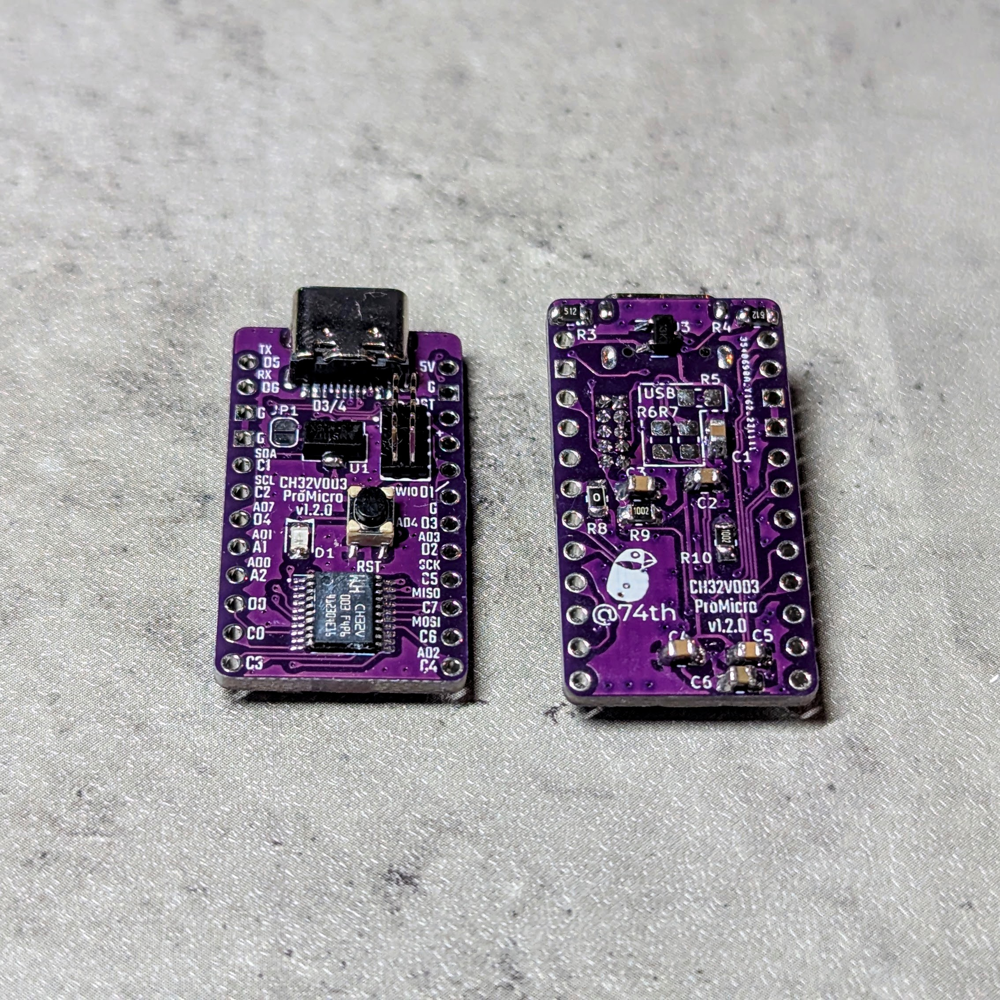
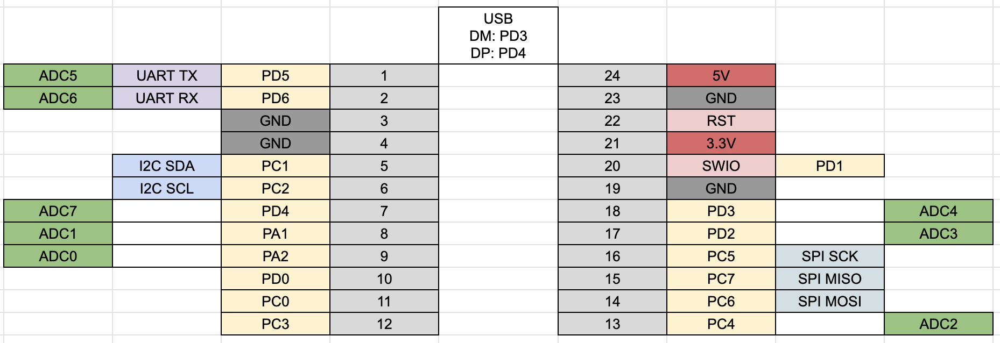

# WCH CH32V003 ProMicro サイズ開発ボード

## features

- ProMicro size
  - To emulate a ProMicro, as the CH32V003 lacks sufficient GPIOs, pin 19 (20/A2) is connected to GND via a 0-ohm resistor (R5).
- The MCU's VCC is set to 3.3V, but can be switched to 5V by connecting JP1 and removing the U2 3.3V regulator.
- v1.1.0~: The USB D+/- is pre-wired to D3 and D4 for using rv003usb. If not used, simply do not mount the damping resistors.
- The oscillator used is the MCU's built-in oscillator.

🇯🇵

- ProMicroサイズ
  - ProMicro を再現するには、CH32V003 は GPIO の数が足りないため、19 Pin（20/A2） を R5 0R で GND 接続するようにしています。
- MCU の VCC は 3.3V になっていますが、JP1 を接続し、U2 3.3V レギュレータを外すことで、5V にすることができます。
- v1.1.0~: USB D+/- は rv003usb を使う前提で、D3、D4 に配線済み。不使用の場合にはダンピング抵抗を未実装にするだけ。
- 発振器にはMCU内蔵発振器を使います

## CH32V003ProMicro v1.2.0

### Changes

- Changed power supply protection IC from CH217K to CH213K

🇯🇵

- 電源保護 IC を、CH217K から CH213K に変更

### DataSheet

- Semantics [PDF](docs/ch32v003-promicro-semantics-v1.2.0.pdf) [kicanvas](https://kicanvas.org/?github=https%3A%2F%2Fgithub.com%2F74th%2Fch32v-dev-boards%2Fblob%2Fch32v003promicro%2F1.2.0%2Fch32v003-promicro%2Fch32v003-promicro.kicad_sch)
- PCB [kicanvas](https://kicanvas.org/?github=https%3A%2F%2Fgithub.com%2F74th%2Fch32v-dev-boards%2Fblob%2Fch32v003promicro%2F1.2.0%2Fch32v003-promicro%2Fch32v003-promicro.kicad_pcb)

### Pin Out

### BOM

| Reference | Name                              | Quantity |
| --------- | --------------------------------- | -------- |
| C1, C2    | Capacitor 0805 10uF               | 2        |
| C3-C5     | Capacitor 0805 100nF              | 3        |
| C6        | Capacitor 0805 1uF                | 1        |
| D1        | LED 0805 Blue                     | 1        |
| J1        | USB Type-C Receptacle             | 1        |
| J2        | Pin Header 2x5 Pitch 1.27mm       | 1        |
| JP1       | Jumper SolderJumper_2_Open        | 1        |
| R3, R4    | Register 0805 5.1kΩ               | 2        |
| R5        | Register 0805 1.5kΩ (NC)          | 1        |
| R6, R7    | Register 0805 27.4Ω (NC)          | 2        |
| R8        | Register 0805 0Ω                  | 1        |
| R9, R10   | Register 0805 10kΩ                | 2        |
| SW1       | Button SKRPABE010                 | 1        |
| U1        | Regulator 3.3V SOT-89 AMS1117-3.3 | 1        |
| U2        | MCU TSSOP20 WCH CH32V003F4P6      | 1        |

## CH32V003ProMicro v1.1.0

### Changes

- Pin assignment change.
- v1.1.0~: The USB D+/- is pre-wired to D3 and D4 for using rv003usb. If not used, simply do not mount the damping resistors.
- Removed external oscillator. Assuming that the internal oscillator is used.

🇯🇵

- ピン配置変更。
- USB D+/-は rv32usb を使う前提で、D3、D4 に配線済み。不使用の場合にはダンピング抵抗を未実装にするだけ。
- 外部発振器を削除。内蔵発振器を使う前提。

### DataSheet

- Semantics [PDF](ch32v003-promicro-semantics-v1.1.0.pdf) [kicanvas](https://kicanvas.org/?github=https%3A%2F%2Fgithub.com%2F74th%2Fch32v-dev-boards%2Fblob%2Fch32v003promicro%2F1.1.0%2Fch32v003-promicro%2Fch32v003-promicro.kicad_sch)
- PCB [PDF](ch32v003-promicro-pcb-v1.1.0.pdf) [kicanvas](https://kicanvas.org/?github=https%3A%2F%2Fgithub.com%2F74th%2Fch32v-dev-boards%2Fblob%2Fch32v003promicro%2F1.1.0%2Fch32v003-promicro%2Fch32v003-promicro.kicad_pcb)

### ピン配置 Pin Out

### BOM

| Reference   | Name                                     | Quantity |
| ----------- | ---------------------------------------- | -------- |
| C1, C2      | Capacitor 0805 10uF                      | 2        |
| C3-C5       | Capacitor 0805 100nF                     | 3        |
| C6          | Capacitor 0805 1uF                       | 1        |
| D1          | LED 0805 Blue                            | 1        |
| J1          | USB Type-C Receptacle - USB2.0_C_v3      | 1        |
| J2          | Box Pin Header 2x5 Pitch 1.27mm          | 1        |
| JP1         | Jumper SolderJumper_2_Open               | 1        |
| R1, R9, R10 | Register 0805 10kΩ                       | 3        |
| R2          | Register 0805 54-56kΩ                    | 1        |
| R3, R4      | Register 0805 5.1kΩ                      | 2        |
| R5          | Register 0805 1.5kΩ (NC)                 | 1        |
| R6, R7      | Register 0805 27.4Ω (NC)                 | 2        |
| R8          | Register 0805 0Ω                         | 1        |
| SW1         | Button SKRPABE010                        | 1        |
| U1          | Regulator 3.3V SOT-89 AMS1117-3.3        | 1        |
| U2          | MCU TSSOP20 WCH CH32V003F4P6             | 1        |
| U3          | USB Power Protection IC SOT-23-6L CH217K | 1        |

## CH32V003ProMicro v1.0.1

### features

- 裏面には、バージョンは v1.0.0 と表記されていますが、v1.0.1 の誤りです。
- USB ソケットは 5V 電源専用であり、通信はできません。
- キットには、クリスタル及びクリスタル横のコンデンサは含まれていません。内蔵発信器を使用するため、不要です。外部発信器を使用する場合は、SMD 3225 24MHz クリスタルと、0805 22pF のコンデンサを、用意の上実装してください。
- ProMicro を再現するには、CH32V003 は GPIO の数が足りないため、19 Pin を R5 0R で GND 接続するようにしています。
- MCU の VCC は 3.3V になっていますが、JP1 を接続し、U2 3.3V レギュレータを外すことで、5V にすることができます。

### Data Sheet

- Semantics [PDF](ch32v003-promicro-semantics-v1.0.1.pdf) [kicanvas](https://kicanvas.org/?github=https%3A%2F%2Fgithub.com%2F74th%2Fch32v-dev-boards%2Fblob%2Fch32v003promicro%2F1.0.1%2Fch32v003-promicro%2Fch32v003-promicro.kicad_sch)
- PCB [PDF](ch32v003-promicro-pcb-v1.0.1.pdf) [kicanvas](https://kicanvas.org/?github=https%3A%2F%2Fgithub.com%2F74th%2Fch32v-dev-boards%2Fblob%2Fch32v003promicro%2F1.0.1%2Fch32v003-promicro%2Fch32v003-promicro.kicad_pcb)

### ピン配置 Pin Out

### 部品表 Parts List

| Reference | Parts                            |
| --------- | -------------------------------- |
| R1        | 0805 Register 10k                |
| R2,R3     | 0805 Register 5.1kR              |
| R4        | 0805 Register 200R or 1kR        |
| R5        | 0805 Register 0R                 |
| C1,C2,C3  | 0805 Capacitor 100nF             |
| C4,C5     | 0805 Capacitor 22p (NC)          |
| C6        | 0805 Capacitor 10uF              |
| C7        | 0805 Capacitor 2.2uF             |
| D1        | 0805 LED                         |
| U1        | TSSOP20 CH32V003F4P6             |
| U2        | SOT89 3.3V Regulator AMS1117-3.3 |
| Y1        | 3225 4Pin Crystal 24MHz (NC)     |
| J1        | SMD USB-C 2.0 Socket             |
| SW1       | SKRPABE010 SMD Push Switch       |
