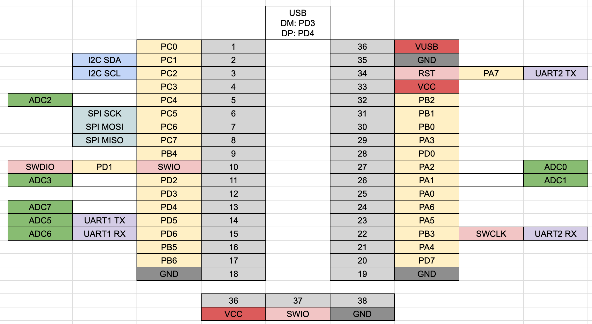

# CH32V006-full Dev Board

## target mcu

- CH32V006K8U6

## 1.0.0

### PinOut

### BOM

| Reference | Name                            | Package          | Quantity |
| --------- | ------------------------------- | ---------------- | -------- |
| C1-2      | Capacitor 10uF                  | SMD 0603in 1608M | 2        |
| C3-4      | Capacitor 100nF                 | SMD 0603in 1608M | 2        |
| J1        | USB Type-C Receptacle           |                  | 1        |
| J2        | Box Pin Header 2x5 Pitch 1.27mm | TH               | 1        |
| JP1       | Jumper Jumper_2_Open            |                  | 1        |
| R1-2      | Register 5.1kΩ                  | SMD 0603in 1608M | 2        |
| R3-4      | Register 10Ω (NC)               | SMD 0603in 1608M | 2        |
| R5        | Register 1.5kΩ (NC)             | SMD 0603in 1608M | 1        |
| SW1       | Button SKRPABE010               |                  | 1        |
| U1        | MCU WCH CH32V006K8U6            | QFN32            | 1        |
| U2        | USB Power Protection IC CH213K  | SOT-23           | 1        |
| U3        | Regulator 3.3V AMS1117-3.3      | SOT-89           | 1        |

### DataSheet

- Semantics [PDF](docs/CH32V006-full-1.0.0-semantics.pdf) [kicanvas](https://kicanvas.org/?github=https%3A%2F%2Fgithub.com%2F74th%2Fch32v-dev-boards%2Fblob%2Fch32v006-full%2F1.0.0%2Fch32v006-full%2FCH32V006-full.kicad_sch)
- PCB [kicanvas](https://kicanvas.org/?github=https%3A%2F%2Fgithub.com%2F74th%2Fch32v-dev-boards%2Fblob%2Fch32v006-full%2F1.0.0%2Fch32v006-full%2FCH32V006-full.kicad_pcb)
