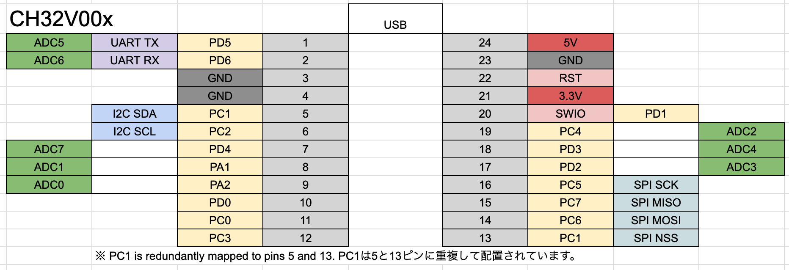

# WCH CH32V00x ProMicro-Sized Development Board

CH32V003 ProMicro v1.3.0から、USBへの配線を取り除いてシンプルにするために、forkしました。

## features

- ProMicro size
  - To replicate the ProMicro, the CH32V003 lacks sufficient GPIOs, so PC1 is connected to both pin 5 (2/SDA) and pin 13 (10/A10).
- The MCU's VCC is set to 3.3V, but can be switched to 5V by connecting JP1 and removing the U2 3.3V regulator.
- The oscillator used is the MCU's built-in oscillator.

🇯🇵

- ProMicroサイズ
  - ProMicro を再現するには、CH32V003 は GPIO の数が足りないため、PC1が 5ピン（2/SDA）と13ピン（10/A10）に接続されています。
- MCU の VCC は 3.3V になっていますが、JP1 を接続し、U2 3.3V レギュレータを外すことで、5V にすることができます。
- 発振器にはMCU内蔵発振器を使います

## CH32V00x ProMicro v1.3.1

### Changes

- Remove USB Data lines

🇯🇵

- USB データラインを削除

### DataSheet

- Semantics [PDF](docs/ch32v00x-promicro-semantics-v1.3.1.pdf) [kicanvas](https://kicanvas.org/?github=https%3A%2F%2Fgithub.com%2F74th%2Fch32v-dev-boards%2Fblob%2Fch32v00x-promicro%2F1.3.1%2Fch32v00x-promicro%2Fch32v00x-promicro.kicad_sch)
- PCB [kicanvas](https://kicanvas.org/?github=https%3A%2F%2Fgithub.com%2F74th%2Fch32v-dev-boards%2Fblob%2Fch32v00x-promicro%2F1.3.1%2Fch32v00x-promicro%2Fch32v00x-promicro.kicad_pcb)

### Pin Out

### BOM

| Reference | Name                                 | Quantity |
| --------- | ------------------------------------ | -------- |
| C1, C2    | Capacitor 0805 10uF                  | 2        |
| C4        | Capacitor 0805 100nF                 | 1        |
| D1        | LED 0805 Blue                        | 1        |
| J1        | USB Type-C Receptacle                | 1        |
| J2        | Pin Header 2x5 Pitch 1.27mm          | 1        |
| JP1       | Jumper SolderJumper_2_Open           | 1        |
| R3, R4    | Register 0805 5.1kΩ                  | 2        |
| 10        | Register 0805 10kΩ                   | 1        |
| SW1       | Button SKRPABE010                    | 1        |
| U1        | Regulator 3.3V SOT-89 AMS1117-3.3    | 1        |
| U2        | MCU TSSOP20 WCH CH32V003F4P6         | 1        |
| U3        | USB Power Protection IC CH213 SOT-23 | 1        |
