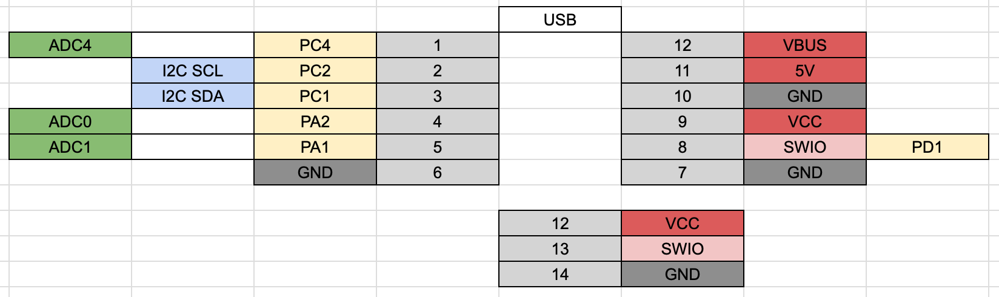

# CH32V00xJxM6 Dev Board

## target mcu

- CH32V003J4M6
- CH32V002J4M6

## 1.0.0

### PinOut

### BOM

| Reference | Name                           | Package          | Quantity |
| --------- | ------------------------------ | ---------------- | -------- |
| C1-2      | Capacitor 10uF                 | SMD 0603in 1608M | 2        |
| C3        | Capacitor 100nF                | SMD 0603in 1608M | 1        |
| J1        | USB Type-C Receptacle          |                  | 1        |
| JP2       | Jumper Jumper_2_Open           |                  | 1        |
| R1-2      | Register 5.1kΩ                 | SMD 0603in 1608M | 2        |
| U1        | MCU WCH CH32V002J4M6           | SOIC-8           | 1        |
| U2        | USB Power Protection IC CH213K | SOT-23           | 1        |
| U3        | Regulator 3.3V AMS1117-3.3     | SOT-89           | 1        |

### DataSheet

- Semantics [PDF](docs/ch32v00x-soic8-1.0.0-semantics.pdf) [kicanvas](https://kicanvas.org/?github=https%3A%2F%2Fgithub.com%2F74th%2Fch32v-dev-boards%2Fblob%2Fch32v00x-soic8%2F1.0.0%2Fch32v00x-soic8%2Fch32v00x-soic8.kicad_sch)
- PCB [kicanvas](https://kicanvas.org/?github=https%3A%2F%2Fgithub.com%2F74th%2Fch32v-dev-boards%2Fblob%2Fch32v00x-soic8%2F1.0.0%2Fch32v00x-soic8%2Fch32v00x-soic8.kicad_pcb)
