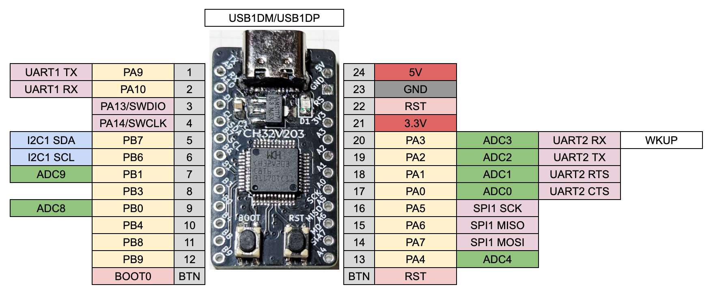

## 製品の概要

WCH 社が提供する RISC-V MCU の CH32V203 を使った ProMicro サイズのマイコン開発ボードです。
CH32V203 は低価格ながら USB デバイス機能を持っています。
ファームウェアの書き換えには、USB 経由で行う機能があり、別途ハードウェアは不要です。

## 特徴

- RISC-V MCU CH32V203 使用。
- UART、I2C、SPI は SparkFun ProMicro と同様のピン配置。
- BOOT ボタンを押しながら RESET を押すと、USB 経由で書き換え可能なモードに。
- デバッガ WCH-Link を使うための、SWDIO、SWCLK ポートを左側 GND の代わりに配置ずみ。
- Arduino サポートあり https://github.com/openwch/arduino_core_ch32

## 仕様

- MCU: WCH CH32V203
- サイズ: 35x18x6mm（USB コネクタ含む）
- ボタン: リセット、BOOT0 制御ボタン
- その他: 外部発振器搭載済み、低電力発振器非搭載
- ピン配置図

## ファームウェアの書き換え方法

PC に USB で接続し、BOOT ボタンを押しながら RST を押すと、USB が認識します。以下のツールで書き換え可能です。

- https://github.com/ch32-rs/wchisp
- https://www.wch-ic.com/downloads/WCHISPTool_Setup_exe.html

※ Arduino 環境はデバッガ WCH-LinkE を使う前提になっているため、ファームウェア作成後、上記ツールでの書き込みが必要です。
※ サポートページも参照ください。

## 内容物

- 1x 74th. CH32V203 ProMicro Like

## 資料

- 回路図 https://github.com/74th/ch32v-dev-boards/blob/main/ch32v203-promicro/docs/ch32v203-promicro-v1.2.1.pdf
- サポートページ https://github.com/74th/ch32v-dev-boards/tree/main/ch32v203-promicro
