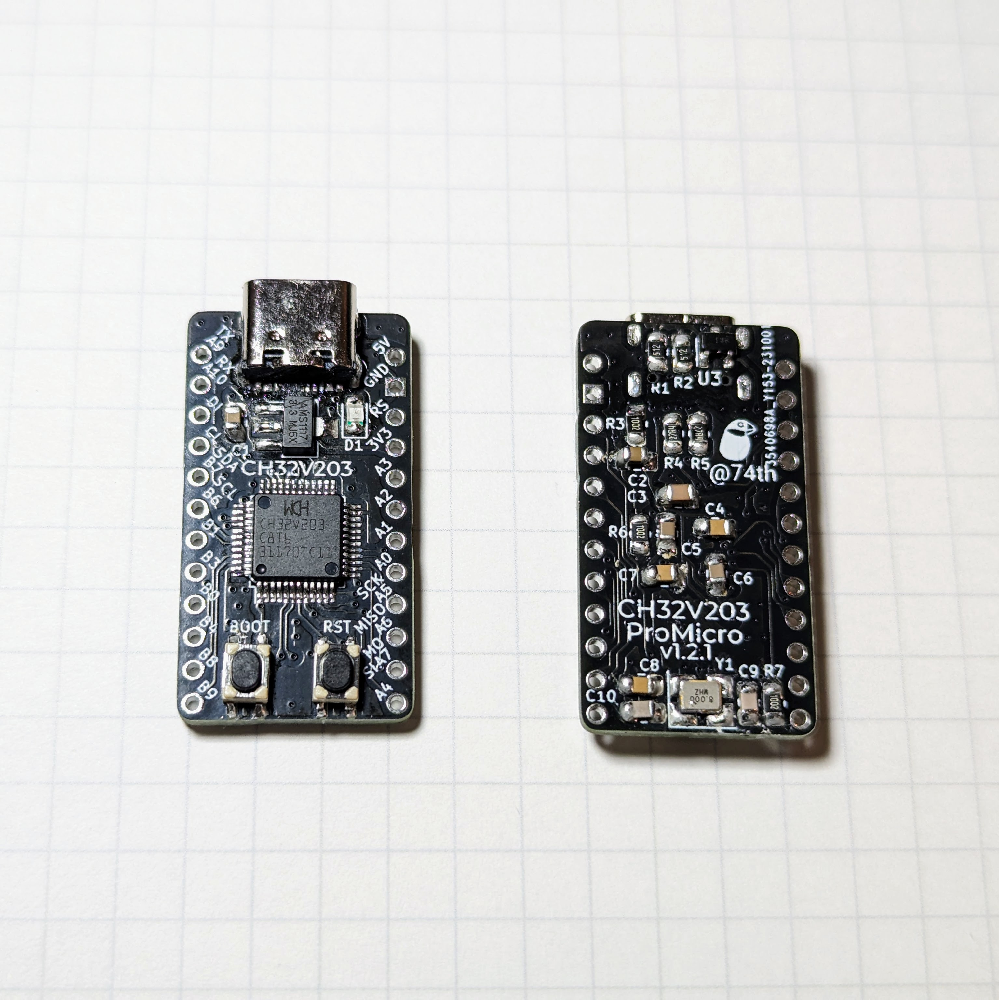
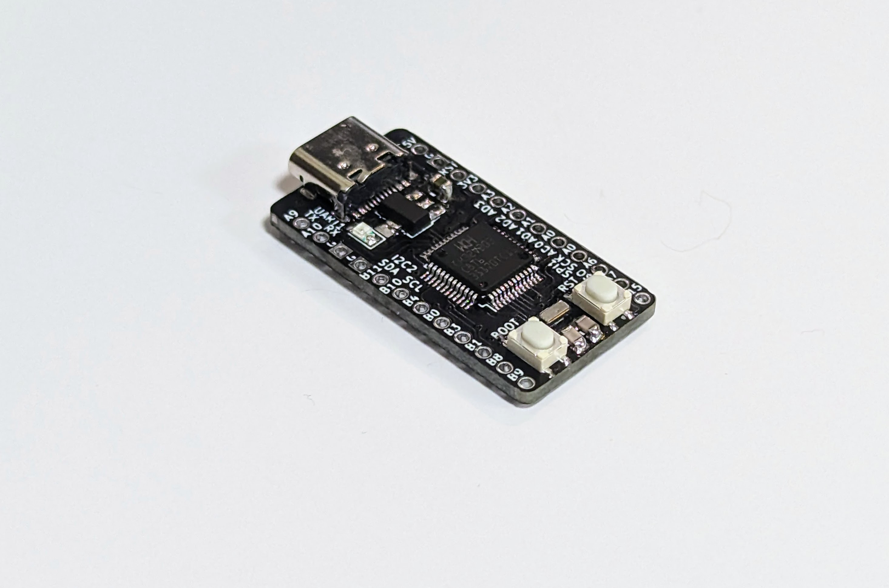
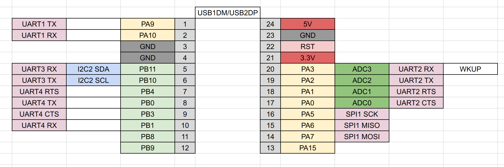
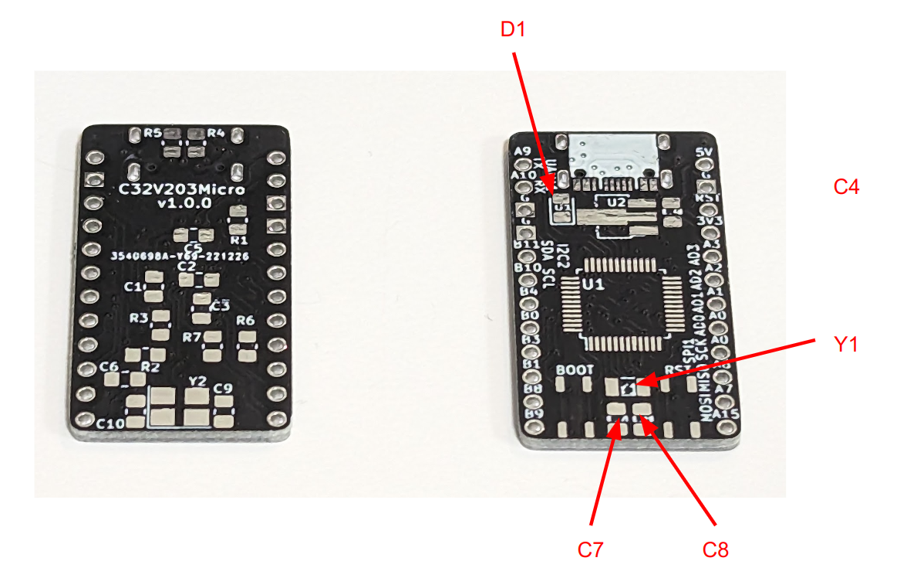

# RISC-V MCU CH32V203 ProMicro Sized Dev Board



- [CH32V203 での開発方法について](#CH32V203-の開発方法)
- キット販売ページ(BOOTH) https://74th.booth.pm/items/4492691

# main features

- Uses RISC-V CH32V203C8T6, resembling STM32.
- Pin configuration with functions similar to ProMicro (UART, I2C, SPI, ADC).
- By pressing the BOOT button while pressing RESET, it enters a mode that allows writing via USB.
- USB1DM/DP already wired to USB Port(USB2 not wired).

🇯🇵

- STM32 に似せた RISC-V CH32V203C8T6 を使用
- ProMicro に近い機能のピン配置（UART、I2C、SPI、ADC）
- BOOT ボタンを押しながら RESET を押すことで、USB で書き込みできるモードに入る
- USB には、USB1DM/DP を配線済み

# How to use 使い方

- There is a BOOT button, and by pressing the BOOT button while holding down RESET(RST), the mode is set to write via USB.
- GND on the left side is changed to SWDIO and SWCLK. Connect WCH-Link to GND, SWDIO, and SWCLK.

🇯🇵

- BOOT ボタンがあり、RESET を押しながら BOOT ボタンを押すことで、USB 経由で書き込めるモードになります。
- 左側の GND を、SWDIO、SWCLK に変更しています。こちらから WCH-Link を用いることで書き込みができるようになります。WCH-Link と GND、SWDIO、SWCLK を接続してください。

# Documents

## CH32V203Micro v1.2.1

- semantics [PDF](./docs/ch32v203-promicro-v1.2.1.pdf) [Kicanvas](https://kicanvas.org/?github=https%3A%2F%2Fgithub.com%2F74th%2Fch32v-dev-boards%2Fblob%2Fch32v203promicro%2F1.2.1%2Fch32v203-promicro%2Fch32v203-promicro.kicad_sch)
- PCB [Kicanvas](https://kicanvas.org/?github=https%3A%2F%2Fgithub.com%2F74th%2Fch32v-dev-boards%2Fblob%2Fch32v203promicro%2F1.2.1%2Fch32v203-promicro%2Fch32v203-promicro.kicad_pcb)

### Pin Map


### new feature

- Anticipating the use of the USB write function, the following changes have been made:
  - The X32Micro v1.2.0 added an SWD 10-pin port, but it was removed in the CH32V203Micro v1.2.1.
  - The X32Micro v1.2.0 removed the BOOT button, but it was re-added in the CH32V203Micro v1.2.1.
  - The X32Micro v1.2.0 added through-holes for BOOT0 and BOOT1, but these were removed. This is because basically only BOOT0 is used.
- Differences from X32Micro v1.1.0:
  - Added CH213K as a USB power protection IC.
  - Added damping resistors to USB DM/DP.
  - Omitted the low-power crystal oscillator (internal RC clock can be used).
  - Pin configuration change.

🇯🇵

- USB で書き込みできる機能を利用する想定で、以下の変更を行いました。
  - X32Micro v1.2.0 では SWD 10 ピンポートを追加しましたが、CH32V203Micro v1.2.1 ではを削除しました。
  - X32Micro v1.2.0 では BOOT ボタンを削除しましたが、CH32V203Micro v1.2.1 では、BOOT ボタンを再度追加しました。
  - X32Micro v1.2.0 では BOOT0、BOOT1 のスルーホールを追加しましたが、削除しました。BOOT0 しか基本的に利用されないためです。
- X32Micro v1.1.0 からの差分
  - USB 電源保護 IC として CH213K を追加
  - USB DM/DP にダンピング抵抗を追加
  - Low Power 用水晶発振器を省略（内蔵 RC クロックが使用可能）
  - ピン配置変更

### 部品表 Parts List

| Reference  | Name                                  | Quantity |
| ---------- | ------------------------------------- | -------- |
| C1, C2     | Capacitor 0805 10uF                   | 2        |
| C3         | Capacitor 0805 1uF                    | 1        |
| C4-C8      | Capacitor 0805 100nF                  | 5        |
| C9, C10    | Capacitor 0805 10-22pF                | 2        |
| D1         | LED 0805 BLUE                         | 1        |
| J1         | USB Type-C Receptacle                 | 1        |
| R1, R2     | Register 0805 5.1kΩ                   | 2        |
| R3, R6, R7 | Register 0805 10kΩ                    | 3        |
| R4, R5     | Register 0805 27Ω                     | 2        |
| SW1, SW2   | Button SKRPABE010                     | 2        |
| U1         | Regulator 3.3V SOT-89 AMS1117-3.3     | 1        |
| U2         | MCU LQFP48 WCH CH32V203C8T6           | 1        |
| U3         | USB Power Protection IC SOT-23 CH213K | 1        |
| Y1         | Crystal 3225 8MHz                     | 1        |

## X32Micro v1.2.0

Please see [https://github.com/74th/x32promicro?tab=readme-ov-file#x32micro-v120](https://github.com/74th/x32promicro?tab=readme-ov-file#x32micro-v120).

## X32Micro v1.1.0

### 部品表 Parts List

| Reference | Parts                                       | Qty |
| --------- | ------------------------------------------- | --- |
| C1-C3, C6 | 0805 Capacitor 100n                         | 4   |
| C4        | 0805 Capacitor 10u                          | 1   |
| C5        | 0805 Capacitor 2.2u                         | 1   |
| C7, C8    | 0805 Capacitor 12p                          | 2   |
| C9, C10   | 0805 Capacitor 22p                          | 2   |
| R1        | 0805 Resister 200                           | 1   |
| R2        | NC or 0805 Resister 10k for BOOT0 Pull Up   | 1   |
| R8        | NC or 0805 Resister 10k for BOOT0 Pull Down | 1   |
| R6-R7     | 0805 Resister 10k                           | 2   |
| R3        | 0805 Resister 0 R                           | 1   |
| R4, R5    | 0805 Resister 5.1k                          | 2   |
| D1        | 0805 LED                                    | 1   |
| J1        | USB2.0 Socket                               | 1   |
| JP1       | Jumper BOOT SW Pull Up / Down               | 1   |
| SW1, SW2  | SW Push                                     | 2   |
| U1        | MCU STM32V103C8T6                           | 1   |
| U2        | SOT-89 Regulator AMS1117-3.3                | 1   |
| Y1        | 3215 Oscillator 32.768k                     | 1   |
| Y2        | 3225 Oscillator 8M                          | 1   |

- CH32V203 など BOOT0 を Pull Up し、BOOT スイッチで GND に繋ぎたい場合
  - R2 を実装してください
  - R8 は未実装 NC にしてください
  - JP1 の中央のランドを △ マークにジャンパしてください
- STM32F103 など BOOT0 を Pull Down し、BOOT スイッチで 3V3 に繋ぎたい場合
  - R2 は未実装 NC にしてください
  - R8 を実装してください
  - JP1 の中央のランドを + マークにジャンパしてください

## CH32V203Micro v1.0.0





- BOOTH 販売ページ
- 回路図 Semantics [docs/ch32v203-promicro-v1.0.0-semantics.pdf](docs/ch32v203-promicro-v1.0.0-semantics.pdf)
- PCB [docs/ch32v203-promicro-v1.0.0-pcb.pdf](docs/ch32v203-promicro-v1.0.0-pcb.pdf)

### 部品表 Parts List

| Reference | Parts                             | num |
| --------- | --------------------------------- | --- |
| C1-C3,C6  | 0805 Capacitor 100nF              | 4   |
| C4        | 0805 Capacitor 10uF               | 1   |
| C5        | 0805 Capacitor 2.2uF              | 1   |
| C7,C8     | 0805 Capacitor 12pF               | 2   |
| C9,C10    | 0805 Capacitor 22pF               | 2   |
| D1        | 0805 LED                          | 1   |
| J1        | USB Type-C Socket                 | 1   |
| J2        | PinHeader                         | 1   |
| J3        | PinHeader                         | 1   |
| R1        | 0805 Register 200R                | 1   |
| R2,R6,R7  | 0805 Register 10kR                | 3   |
| R3        | 0805 Register 0R                  | 1   |
| R4,R5     | 0805 Register 5.1k                | 2   |
| SW1       | SW Push                           | 2   |
| U1        | MCU CH32V203CxT6                  | 1   |
| U2        | SOT-89 3.3V Regulator AMS1117-3.3 | 1   |
| Y1        | 3215 Oscillator 32.768kHz         | 1   |
| Y2        | 3225 Oscillator 8MB               | 1   |



# CH32V203 の開発方法

## CH32V203 のファームウェアの書き込み方法

### 1. USB で書き込み場合

BOOT を押しながら、RESET を押すと、USB で書き込みを受け付けるモードになります。このモード中では、以下のソフトウェアを用いて書き込みが可能です。

- WCHISP Tool(公式) : https://www.wch-ic.com/downloads/WCHISPTool_Setup_exe.html
  - GUI で操作するツール
  - Windows のみ
- wchisp(ch32-rs) : https://github.com/ch32-rs/wchisp
  - CLI ツール

私 74th としては、wchisp が、Linux でも動作するため、便利でお勧めです。以下のようにして、書き込みます。

```
wchisp flash release/ch32v203c8t6.elf
```

### 2. WCH-Link を用いる場合

WCH-Link と SWDIO、SWCLK を接続してください。

WCH-Link を用いる場合の書き込みソフトウェアとして、以下があります。

- WCH-LinkUtility(公式) : https://www.wch.cn/downloads/WCH-LinkUtility_ZIP.html
  - GUI で操作するツール
  - Windows のみ
- minichlink(ch32v003fun) : https://github.com/cnlohr/ch32v003fun/tree/master/minichlink
  - CLI ツール
- wlink(ch32-rs) : https://github.com/ch32-rs/wlink
  - CLI ツール
- OpenOCD(WCH によるフォーク): MounRiverStudio に含まれる http://www.mounriver.com/download
  - CLI ツール

74th としては、wlink が、Linux でも動作するため、便利でお勧めです。

```
wlink flash release/ch32v203c8t6.elf
```

## CH32V203 の開発環境

PlatformIO(VS Code)を使った開発の方法を記事にしています

> WCH の RISC-V マイコン CH32V を公式 SDK を使って、VS Code の PlatformIO で開発する - @74th の制作ログ
>
> https://74th.hateblo.jp/entry/ch32v-platformio

CH32V203 の開発フレームワークとして以下が利用可能です。

- 公式 SDK: https://github.com/openwch/ch32v20x/tree/main/C%2B%2B/Use%20MRS%20Create%20C%2B%2B%20project-example/CH32V203C8T6%2B%2B
  - C/C++
  - STM32 の古い SDK 似
- ch32-rs: https://github.com/ch32-rs/ch32-rs
  - Rust のペリフェラルアクセスクレート
- WCH 提供 Arduino: https://github.com/openwch/arduino_core_ch32

開発環境としては、以下が利用できます。

- MounRiverStudio(公式): http://www.mounriver.com/download
  - 公式 SDK を利用
  - Windows、Linux のみ
- PlatformIO(コミュニティメンテ) : https://github.com/Community-PIO-CH32V/platform-ch32v
  - 公式 SDK を利用
  - MounRiverStudio に含まれる GNU ライセンスの gcc、OpenOCD 等を取り込んでいる
  - gcc、OpenOCD は x64 のみ（ARM CPU では動作不可）
- Rust(ch32v-rs 利用)
- Arduino IDE: https://github.com/openwch/arduino_core_ch32
- 公式 SDK 用 Makefile テンプレート: https://github.com/cjacker/ch32v_evt_makefile_gcc_project_template

74th としては PlatformIO が、環境構築がお手軽でお勧めです。ただし、AMD64 CPU でないと動作しません。

CH32V203 は、RV32IMAC に独自拡張命令を含んだ RV32IMACXW という命令セットを使っています。そのため、公式が提供する GCC でないと正常にコンパイルできないことがあります。

## 開発方法についてのブログ記事等情報

### 74th のブログ記事

- WCH の RISC-V マイコン CH32V を公式 SDK を使って、VS Code の PlatformIO で開発する https://74th.hateblo.jp/entry/ch32v-platformio
- WCH の RISC-V MCU CH32V203 を Rust で L チカする https://74th.hateblo.jp/entry/2022/12/22/223956

### その他記事

- オープンソースツールチェインでの CH32V の開発方法（英語） https://github.com/cjacker/opensource-toolchain-ch32v
- VSCode+PlatformIO で RISC-V CH32V203 マイコンの開発環境を構築 https://zenn.dev/usagi1975/articles/2023-09-30-0002_ch32v-platformio

## 公式ドキュメント

- データシート https://www.wch-ic.com/downloads/CH32V20x_30xDS0_PDF.html
- リファレンスマニュアル https://www.wch-ic.com/downloads/CH32FV2x_V3xRM_PDF.html
- C/C++ SDK https://github.com/openwch/ch32v20x/tree/main/C%2B%2B/Use%20MRS%20Create%20C%2B%2B%20project-example/CH32V203C8T6%2B%2B
