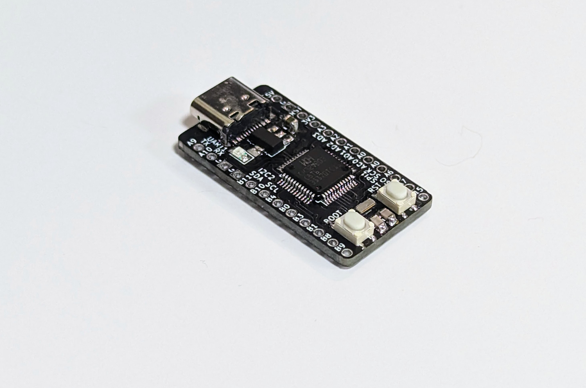
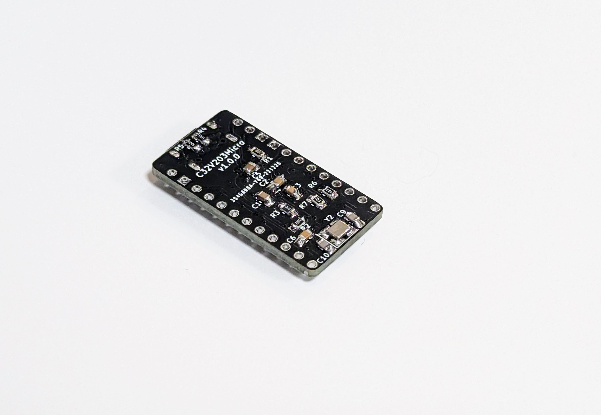
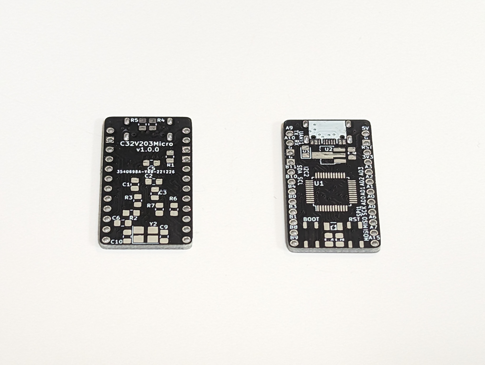
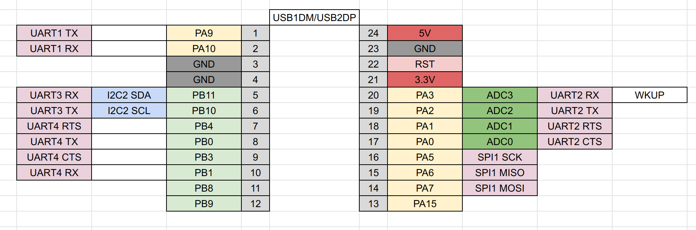

# RISC-V MCU CH32V203 ProMicro サイズ開発ボード (ProMicro sized Dev Board)

## v1.0.0

- BOOTH 販売ページ
- 回路図 Semantics [ch32v203-promicro-v1.0.0-semantics.pdf](ch32v203-promicro-v1.0.0-semantics.pdf)
- PCB [ch32v203-promicro-v1.0.0-pcb.pdf](ch32v203-promicro-v1.0.0-pcb.pdf)

## 部品表 Parts List

| Reference | Parts                             | num |
| --------- | --------------------------------- | --- |
| C1-C3,C6  | 0805 Capacitor 100nF              | 4   |
| C4        | 0805 Capacitor 10uF               | 1   |
| C5        | 0805 Capacitor 2.2uF              | 1   |
| C7,C8     | 0805 Capacitor 12pF               | 2   |
| C9,C10    | 0805 Capacitor 22pF               | 2   |
| D1        | 0805 LED                          | 1   |
| J1        | USB Type-C Socket                 | 1   |
| J2        | PinHeader                         | 1   |
| J3        | PinHeader                         | 1   |
| R1        | 0805 Register 200R                | 1   |
| R2,R6,R7  | 0805 Register 10kR                | 3   |
| R3        | 0805 Register 0R                  | 1   |
| R4,R5     | 0805 Register 5.1k                | 2   |
| SW1       | SW Push                           | 2   |
| U1        | MCU CH32V203CxT6                  | 1   |
| U2        | SOT-89 3.3V Regulator AMS1117-3.3 | 1   |
| Y1        | 3215 Crystal 32.768kHz            | 1   |
| Y2        | 3225 Crystal 8MB                  | 1   |

