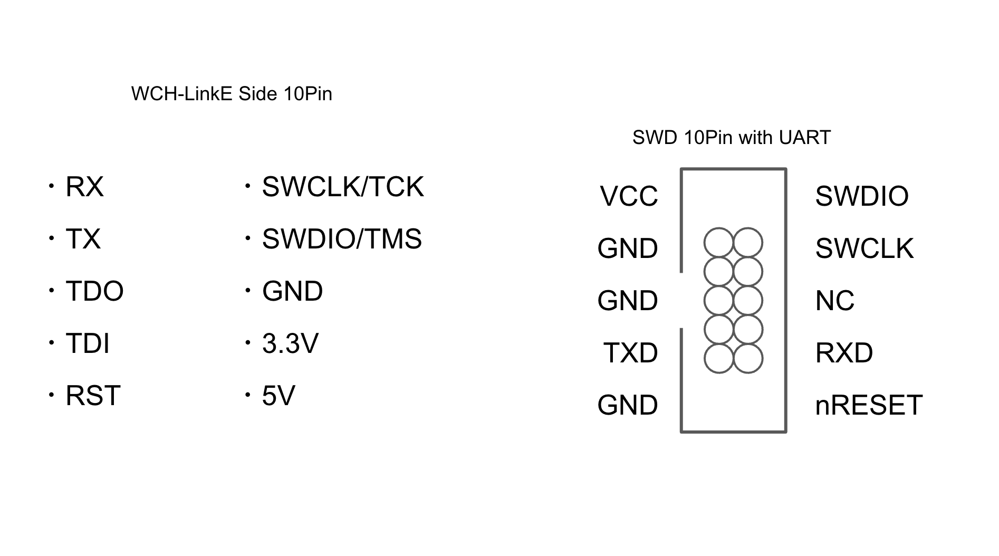

# WCH-LinkE SWD Adapter

WCH-LinkE をハーフピッチ SWD UART 付きインターフェイスに変換するアダプタです。VCC から 3.3V 取り出されます。

74th の CH32V003 等の開発ボードにはこのポートが付いています。

## 従来の SWD ポートの変更点

- VCC は本来相手先デバイスが電源オンかどうかを判定する入力端子ですが、相手先デバイスを起動できると便利なため、3.3V 出力端子に変更しています。
- 本来 SWD には UART の仕様はありませんが、Arduino UNO R4 の SWD ポートに倣って UART を追加しています。

## documents

### v1.0.0

- semantics [PDF](./wchlinke-swd-adapter-v1.0.0.pdf) [Kicanvas](https://kicanvas.org/?github=https%3A%2F%2Fgithub.com%2F74th%2Fch32v-dev-boards%2Fblob%2Fwchlinke-swd-adapter%2F1.0.0%2Fwchlinke-swd-adapter%2Fwchlinke-swd-adapter.kicad_sch)
- PCB [Kicanvas](https://kicanvas.org/?github=https%3A%2F%2Fgithub.com%2F74th%2Fch32v-dev-boards%2Fblob%2Fwchlinke-swd-adapter%2F1.0.0%2Fwchlinke-swd-adapter%2Fwchlinke-swd-adapter.kicad_pcb)
